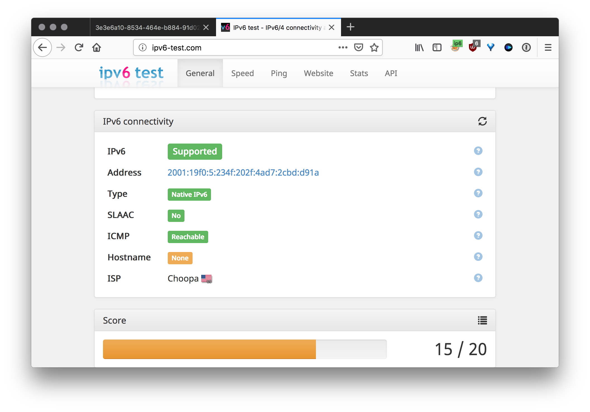

Create SOCKS5 proxies with IPv6 support - redirect connections from different ports at one IPv4 address to unique random IPv6 addresses from /64 subnetwork. Based on 3proxy

## Requirements
- CentOS 7/8/9 or CentOS Stream 9
- IPv6 /64 subnet

## Installation
[Video tutorial](https://youtu.be/EKBJHSTmT4w), VPS from Vultr used as Centos setup

1. `bash <(curl -s "https://raw.githubusercontent.com/rafaelb128/ipv6-proxy-creator/main/scripts/install.sh")`

1. After installation download the file `proxy.zip`
   * File structure: `IP4:PORT:LOGIN:PASS` (SOCKS5 format)
   * You can use this online [util](http://buyproxies.org/panel/format.php) to change proxy format as you like

## Test your SOCKS5 proxy

Install [FoxyProxy](https://addons.mozilla.org/en-US/firefox/addon/foxyproxy-standard/) in Firefox

Open [ipv6-test.com](http://ipv6-test.com/) and check your connection

